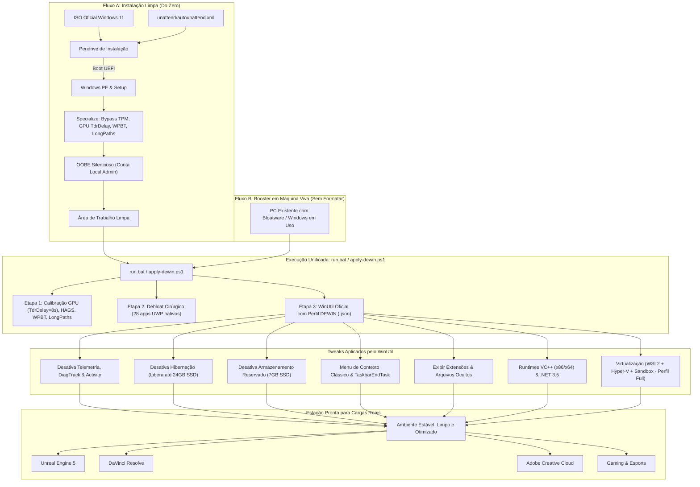

# Arquitetura do Projeto DEWIN

O projeto **DEWIN** é um ecossistema modular e estruturado para entregar o máximo em desempenho, baixa latência, estabilidade de render e limpeza de processos no **Windows 11 Pro 25H2 x64 (pt-BR)**.

---

## 1. Princípios Arquiteturais

1. **ISO 100% Oficial**: Nunca utilizar ISOs modificadas de terceiros (Tiny11, ReviOS, AtlasOS, Ghost Spectre). Modificações externas inserem binários opacos e quebram recursos de segurança e estabilidade.
2. **Modelo Híbrido de Dois Fluxos de Usuário**:
   * **Fluxo A (Instalação Limpa via Pendrive)**: Instalação autônoma via `unattend/autounattend.xml` que entrega o sistema já limpo desde o Windows PE, sem conta Microsoft e com tweaks de GPU/Kernel pré-logon.
   * **Fluxo B (Booster em Máquina Viva / Sem Formatar)**: Para computadores em produção onde o usuário não pode formatar, o `scripts/apply-dewin.ps1` atua como um *Booster autossuficiente*, aplicando a calibração de GPU, o debloat cirúrgico dos 28 apps nativos e disparando o WinUtil com o perfil calibrado.
3. **Não-Regressão Funcional**: Nenhuma otimização sacrifica a compatibilidade com ferramentas de produção (Unreal Engine 5, DaVinci Resolve, Adobe Creative Cloud, Docker, WSL2).
4. **Reprodutibilidade Baseada em Código**: Todas as configurações residem em arquivos versionados (`.xml`, `.ps1`, `.json`, `.md`).

---

## 2. Diagrama de Fluxo dos Dois Perfis de Usuário

---

## 3. Divisão de Responsabilidades

| Responsabilidade | Componente Responsável | Fluxo A (Limpo) | Fluxo B (Booster) |
| :--- | :--- | :---: | :---: |
| Bypass de TPM / Secure Boot / RAM | `autounattend.xml` | ✅ (Windows PE) | N/A (Já instalado) |
| Criação da conta local `Admin` sem rede | `autounattend.xml` | ✅ (OOBE) | N/A (Conta existente) |
| Calibração de GPU (`TdrDelay = 8s`, `HAGS`) | `autounattend.xml` + `apply-dewin.ps1` | ✅ | ✅ |
| Bloqueio de injeção WPBT (Asus Armoury Crate) | `autounattend.xml` + `apply-dewin.ps1` | ✅ | ✅ |
| Habilitação de Caminhos Longos (`LongPathsEnabled`) | `autounattend.xml` + `apply-dewin.ps1` | ✅ | ✅ |
| Busca 100% Local (Sem Bing no Iniciar) | `autounattend.xml` + `apply-dewin.ps1` | ✅ | ✅ |
| Debloat Cirúrgico (28 apps UWP nativos) | `autounattend.xml` + `apply-dewin.ps1` | ✅ (Pré-logon) | ✅ (Pós-logon) |
| Menu de Contexto Clássico do Windows 10 | `winutil/*.json` + `autounattend.xml` | ✅ | ✅ |
| Exibir Extensões de Arquivo e Pastas Ocultas | `winutil/*.json` + `autounattend.xml` | ✅ | ✅ |
| Desativação de Hibernação e Armazenamento Reservado | `winutil/*.json` | ✅ | ✅ |
| Instalação de Runtimes (VC++ 2015-2022, .NET 3.5) | `winutil/*.json` | ✅ | ✅ |
| Virtualização Modular (WSL2, Hyper-V, Sandbox) | `winutil/*.json` (Perfil Full) | ✅ | ✅ |

---

## 4. Diretrizes para Hardwares Específicos

### CPU: AMD Ryzen 5 5600X (6c/12t - Zen 3)
* **Gerenciamento de Energia**: O Windows 11 gerencia o Precision Boost 2 (PB2) e os núcleos preferenciais (*Preferred Cores*) através do **AMD CPPC** nativo. Planos de energia agressivos ("Ultimate Performance") que travam os núcleos em 100% aumentam o consumo elétrico e diminuem a capacidade da CPU de atingir as frequências máximas de single-core boost. O DEWIN mantém o plano equilibrado nativo otimizado.

### GPU: NVIDIA GeForce RTX 5060 Ti
* **Hardware-Accelerated GPU Scheduling (HAGS)**: Mantido ativo (`HwSchMode = 2`). Essencial para redução de overhead no pipeline de renderização, suporte a Frame Generation (DLSS 3) e encoders NVENC modernos.
* **TdrDelay**: Ajustado para 8 segundos. Evita que o Windows reinicie o driver da placa de vídeo durante compilação intensa de shaders na Unreal Engine ou nós de Fusion/Color no DaVinci Resolve.

### Placa-mãe: ASUS TUF GAMING B550M-PLUS (Desktop)
* **Bloqueio WPBT**: Desativa a injeção automática de firmware do instalador do Asus Armoury Crate (`DisableWpbtExecution = 1`), impedindo serviços desnecessários da Asus em background.
* **Rede Realtek 2.5GbE**: Preservada para máxima vazão em transferências locais e builds.

### Notebook: Acer Nitro V 15 (Gaming & Workstation Móvel)
* **Gráficos Híbridos & HAGS**: HAGS ativo (`HwSchMode = 2`) para suporte a DLSS 3 e baixa latência. Gerenciamento NVIDIA Optimus preservado para desligar a GPU dedicada quando o notebook opera em bateria.
* **Hibernação Segura**: Hibernação compacta (`powercfg /h /type reduced`) preservada para proteção contra perda de dados em bateria crítica (< 3%) e sono seguro na mochila (Modern Standby S0ix).

### Notebook: ASUS VivoBook 14/15 (Ultrabook Corporativo)
* **Autonomia de Bateria**: Sem sobrecarga de serviços de virtualização Hyper-V em background, reduzindo o consumo de energia em idle e mantendo as temperaturas baixas.
* **Hardware de Teclado & Fn**: Preservados os canais de controle para teclas Fn (brilho, volume, atalho de microfone) e controle de vida útil da bateria.
