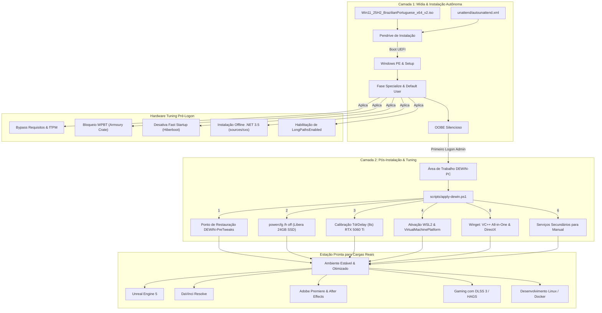

# Arquitetura do Projeto DEWIN

O projeto **DEWIN** é um ecossistema estruturado para a criação de uma instalação limpa, estável, reprodutível e altamente otimizada do **Windows 11 Pro 25H2 x64 (pt-BR)** a partir da ISO oficial da Microsoft.

---

## 1. Princípios Arquiteturais

1. **ISO 100% Oficial**: Nunca utilizar ISOs modificadas de terceiros (Tiny11, ReviOS, AtlasOS, Ghost Spectre). Modificações externas inserem binários opacos e quebram recursos de segurança e estabilidade.
2. **Separação Rígida em Duas Camadas**:
   * **Camada 1 (Instalação / Unattend)**: Aplicação estática de configurações pré-logon sem dependência de internet.
   * **Camada 2 (Pós-Instalação / Automação)**: Aplicação de runtimes, recursos de virtualização, drivers e ajustes finos reversíveis.
3. **Não-Regressão Funcional**: Nenhuma otimização deve sacrificar a compatibilidade com os softwares de produção e desenvolvimento da máquina.
4. **Reprodutibilidade Baseada em Código**: Todas as configurações residem em arquivos versionados (`.xml`, `.ps1`, `.json`, `.md`), permitindo recriar a mesma máquina em qualquer momento.

---

## 2. Diagrama de Fluxo Ponta a Ponta

---

## 3. Divisão de Responsabilidades

| Responsabilidade | Componente Responsável | Momento de Execução |
| :--- | :--- | :--- |
| Bypass de TPM / Secure Boot preventivo | `unattend/autounattend.xml` | Windows PE |
| Aceitação automática de EULA | `unattend/autounattend.xml` | Windows PE |
| Criação da conta local `Admin` | `unattend/autounattend.xml` | OOBE |
| Bloqueio do Asus Armoury Crate via WPBT | `unattend/autounattend.xml` | Specialize |
| Desativação de Bloatware UWP da Nuvem | `unattend/autounattend.xml` | Specialize |
| Habilitação offline do .NET Framework 3.5 | `unattend/autounattend.xml` | First Logon |
| Habilitação de Caminhos Longos (`LongPathsEnabled`) | `unattend/autounattend.xml` | Specialize |
| Calibração de TdrDelay da GPU (8s) para DaVinci/Unreal | `unattend/autounattend.xml` | Specialize |
| Agendamento Acelerado por Hardware (HAGS) ativo | `unattend/autounattend.xml` | Specialize |
| Desativação de Hibernação e liberação de SSD (24 GB) | `winutil/dewin.json` | Pós-Instalação |
| Desativação do Armazenamento Reservado (7 GB) | `winutil/dewin.json` | Pós-Instalação |
| Habilitação do WSL2, Hyper-V e Windows Sandbox | `winutil/dewin.json` | Pós-Instalação |
| Instalação de Runtimes Visual C++ (2015-2022 x86/x64) | `winutil/dewin.json` | Pós-Instalação |
| Instalação de Ferramentas Base (Chrome, 7-Zip) | `winutil/dewin.json` | Pós-Instalação |
| Ajuste de Serviços Secundários para modo Manual | `winutil/dewin.json` | Pós-Instalação |
| Orquestração Unificada One-Click | `scripts/apply-dewin.ps1` | Pós-Instalação |

---

## 4. Diretrizes para Hardwares Específicos

### CPU: AMD Ryzen 5 5600X (6c/12t - Zen 3)
* **Gerenciamento de Energia**: O Windows 11 gerencia o Precision Boost 2 (PB2) e os núcleos preferenciais (*Preferred Cores*) através do **AMD CPPC** nativo. Planos de energia agressivos ("Ultimate Performance") que travam os núcleos em 100% aumentam o consumo elétrico e diminuem a capacidade da CPU de atingir as frequências máximas de single-core boost. O DEWIN mantém o plano equilibrado nativo otimizado.

### GPU: NVIDIA GeForce RTX 5060 Ti
* **Hardware-Accelerated GPU Scheduling (HAGS)**: Mantido ativo (`HwSchMode = 2`). Essencial para redução de overhead no pipeline de renderização, suporte a Frame Generation (DLSS 3) e encoders NVENC modernos.
* **TdrDelay**: Ajustado para 8 segundos. Evita que o Windows reinicie o driver da placa de vídeo durante compilação intensa de shaders na Unreal Engine ou nós de Fusion/Color no DaVinci Resolve.

### Placa-mãe: ASUS TUF GAMING B550M-PLUS
* **Bloqueio WPBT**: Desativa a injeção automática de firmware do instalador do Asus Armoury Crate (`DisableWpbtExecution = 1`), impedindo serviços desnecessários da Asus em background.
* **Rede Realtek 2.5GbE**: Preservada para máxima vazão em transferências locais e builds.
